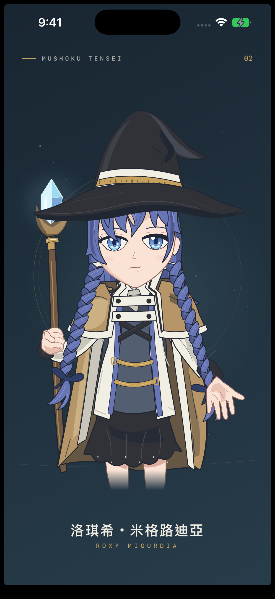

# 洛琪希・形狀練習

以 SwiftUI 內建幾何形狀和自訂 Shape，透過 ZStack 疊出《無職轉生》的洛琪希。新版依動畫設定重畫藍紫色雙辮子、半垂藍眼睛、彎折帽尖、白金帽帶、米棕外袍與水晶法杖；人物與背景均由程式繪製。

  

## 作業內容

- 使用 Circle、Ellipse、Capsule、Rectangle、RoundedRectangle 與自訂 Shape。
- 用 ZStack 排列後髮、外袍、內搭、袖子、衣領、辮子、臉部、瀏海、帽子和手；各主要部位都有中文註解。
- 以二次與三次貝茲曲線描出臉型、髮束、睫毛、衣摺和手指；虹膜與背景使用漸層。
- 背景延伸至全螢幕，29 個 Color Set 在 Assets.xcassets 中設定 sRGB 色彩。
- 依畫面可用空間縮放 540 × 800 的人物畫布。

## 程式結構

| 檔案 | 內容 |
| --- | --- |
| Sources/ContentView.swift | 全螢幕背景、插畫縮放、角色標題 |
| Sources/RoxyIllustration.swift | 背景、法杖、後髮、外袍、內搭、袖子與立領 |
| Sources/RoxyPortraitDetails.swift | 雙辮子、五官、眼睛、瀏海、帽子與手 |
| Sources/IllustrationPath.swift | 曲線座標轉為 SwiftUI Shape，以及填色和描邊 |

IllustrationPath 的座標指令：M 代表起點，L 代表直線，Q 代表二次曲線，C 代表三次曲線，Z 代表閉合。座標描述每個部位的輪廓，使用 SwiftUI Path 實際繪製。

## 開啟專案

使用 Xcode 開啟 RoxyShapeStudy.xcodeproj，選擇 RoxyShapes scheme 與 iPhone 模擬器後執行。

如需重新產生 Xcode 專案檔，可在此資料夾執行 xcodegen generate。

已在 Xcode Beta 27 的 iPhone 17 Pro（iOS 27）模擬器建置並擷取畫面。

## 參考資料

- [#206 參考 Apple 的 Build with Stacks and Shapes](https://medium.com/彼得潘的試煉-勇者的-100-道-swift-ios-app-謎題/206-參考-apple-的-build-with-stacks-and-shapes-用形狀創作自畫像-self-portrait-b4d4a8eef55e)：作業需求與形狀範例。
- [用形狀創作圖案 — 珍奶小攤](https://medium.com/@tumelodymelody/用形狀創作圖案-珍奶小攤-b48c1db25927)：優先參考的作品呈現方式。
- [#02 用形狀創作圖案 — 耀西](https://medium.com/台大-cs-x-ios-app-程式設計/02-用形狀創作圖案-807df61ddeaa)：參考圖拆解與圖層安排。
- [#2 用形狀創作圖案](https://medium.com/台大-cs-x-ios-app-程式設計/2-用形狀創作圖案-3f40956911ce)：幾何形狀組合的作品範例。
- [無職轉生動畫官方角色頁](https://mushokutensei.jp/character/?chara=17&series=3rd_02)：洛琪希的角色設定。
- [動畫角色設定圖的轉載](https://twitter.com/ftloic/status/1409500684899209223)：觀察髮色、雙辮子、帽帶與外袍結構。參考圖未包入 app。
